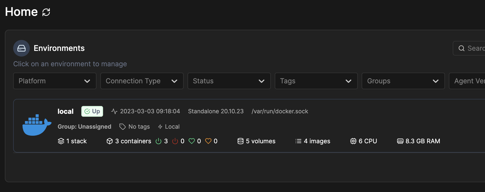
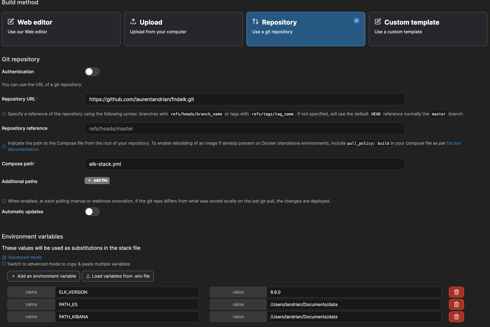
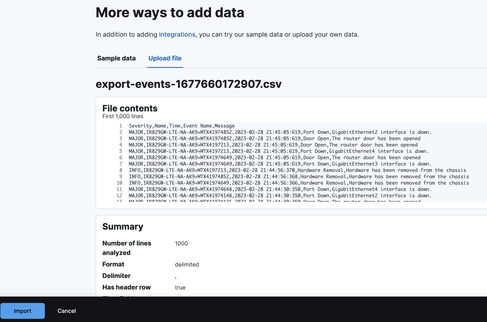
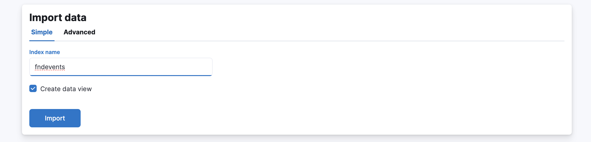
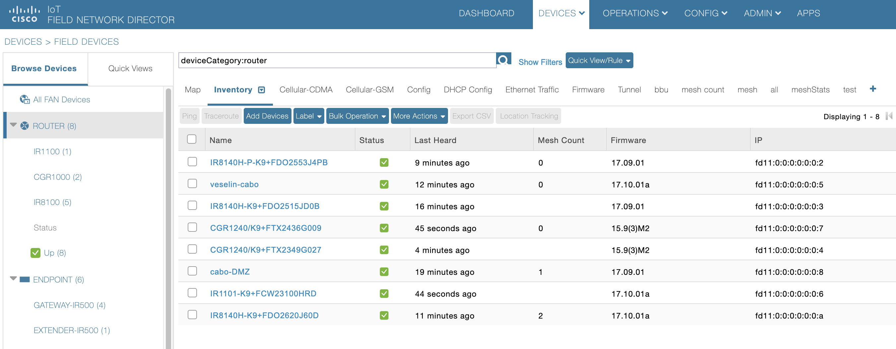

# Using ELK for FND Insights

This repository is aiming to use ELK to get insights in Cisco IOT FND data
The ELK components are deployed in docker containers to be used.

ELK can be used on your laptop (MacOS) or a linux server.
You need to have docker installed.

First I recommend to install portainer:

```
docker run -d -p 8000:8000 -p 9000:9000 --name=portainer --restart=always -v /var/run/docker.sock:/var/run/docker.sock -v portainer_data:/data portainer/portainer-ce
```

This will pull the latest portainer and run portainer locally.

Access portainer UI at http://localhost:9000
You will need to setup a new password.

On the home page select the local environment


Select Stacks then Add Stack, select repository and use: 
- repository URL : https://github.com/laurentandrian/fndelk.git
- compose path: elk-stack.yml
  



Add 3 environment variables:
- ELK_VERSION : e.g. 8.6.0
- PATH_ES : local path to store ES data
- PATH_KIBANA : local path to store Kibana data


Click on deploy stack, portainer will pull the docker images and run the containers.

To access Kibana UI : http://localhost:5601

The first usage is to analyze the FND events. 
From FND UI you can extract all the events into a CSV file with following format:
```
Severity,Name,Time,Event Name,Message
```
The exported file from FND has 3 lines at the beginning, with Events, Exported date, blank line. 
Remove these line and save the CSV file.

To import the updated CSV file in ES, on Kibana UI, Home, there is link with Upload a File, click on this link.


Upload your file, you will see something like this:


Click on Import at bottow left.
Then add the data to a new index.



The other usage is to get insights in FND Inventory.
To export FND inventory, on the FND UI select Devices/Field Devices. 
On the left panel select Routers.
On the right part of the views there is a plus button. 


Click on plus, and create a new view with the following columns:
```
eid,name,status,runningFirmwareVersion,lastHeard,cellularAPN1,cellularIMEI1,cellularIMSI1,cellularRxSpeed1,cellularTxSpeed1,cellularBwPerCycle1,cellularRsrp1,cellularRssi1,cellularSnr1,cellularRsrq1,cellularID1,cellularID3,cellularNetworkName1,ip,labels,lat,lng,configGroup,configLastStatusDate,tunnelGroup
```

Select all the devices and click export as CSV.
Edit the CSV to remove the first 3 lines.
Import the CSV in Kibana using the same process described above, insert the data in index called fndinventory-<date>.
Where date is the import date.

